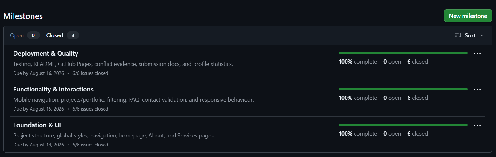
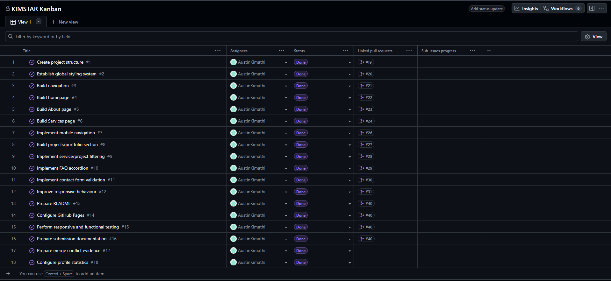
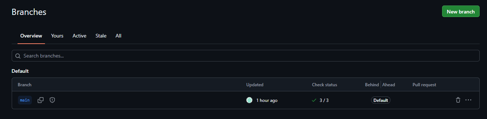
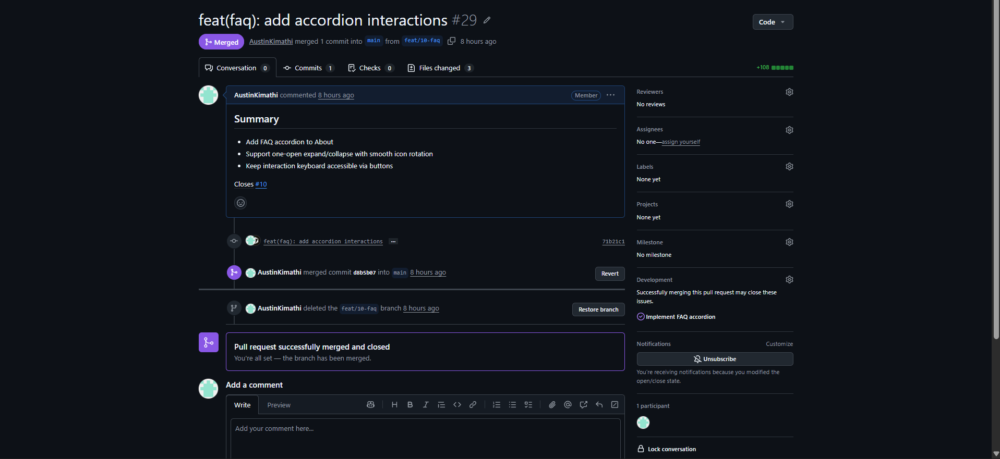
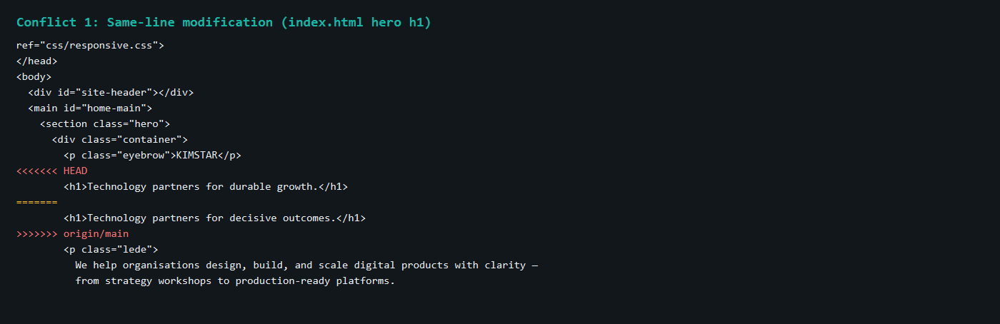
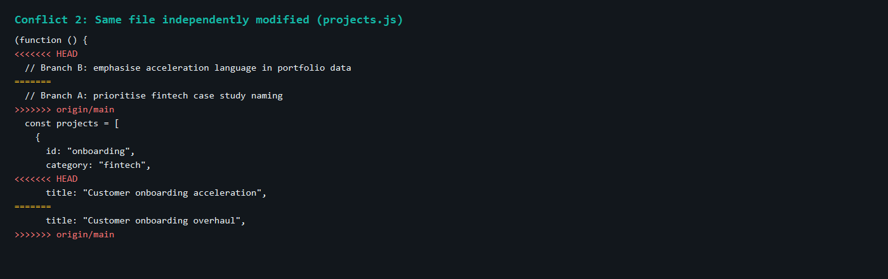
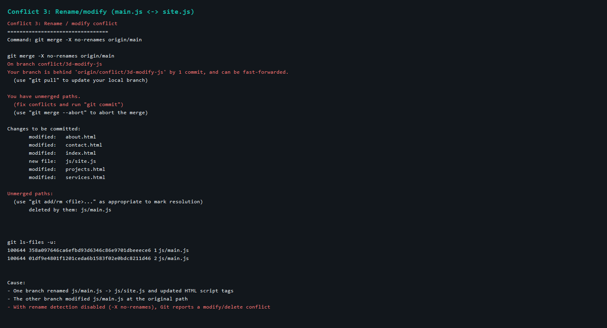

# Project Submission Report

## 1. Student Details

- **Full Name:** Austin Kimathi
- **GitHub Username:** AustinKimathi
- **Email:** austin.kimathi@strathmore.edu

---

## 2. Deployed Project Link

- **Live GitHub Pages URL:** https://is-project-2026.github.io/kimstar-169649/

---

## 3. Reflection — Grounded in Your Git History

> **Rules:** Every answer below **must include a direct link** to the specific commit, PR, issue, or branch in your repository that demonstrates what you are describing. Answers without working links will not be graded. Generic explanations that could apply to any project will receive zero marks.
>
> **Marks:** A (2 marks) · B (1 mark) · C (1 mark) · D (1 mark) = **5 marks total**

### A. Your Best Commit

Paste the URL of the commit in your history that you think best demonstrates clean conventional commit practice (good type tag, clear subject, meaningful body or footer).

- **Commit URL:** https://github.com/IS-PROJECT-2026/kimstar-169649/commit/1f532f4d56163526662bfa7f39af87981c904a8a
- **Why this one?** It uses a clear `feat(contact)` type/scope, an imperative subject under 50 characters, and a body that explains the validation behaviour while tracing the work to issue `#11`.

### B. A Mistake or Struggle

Link to a commit, PR, or issue where something went wrong — a bad commit message you had to fix, a branch you had to delete and recreate, a PR that needed rework, or a deployment that broke.

- **Link to the evidence:** https://github.com/IS-PROJECT-2026/kimstar-169649/pull/37
- **What happened and how did you recover?** The first rename/modify attempt on `css/style.css` was auto-resolved by Git’s rename detection, so the conflict evidence was weak. I recovered by engineering a clearer rename/modify conflict on `js/main.js` → `js/site.js` with `-X no-renames`, capturing real modify/delete evidence, and merging the resolved PR.

### C. A Pull Request You're Proud Of

Paste the URL of the PR that best shows your self-review process — one where the description is clear, the issue linkage is correct, and the diff tells a coherent story.

- **PR URL:** https://github.com/IS-PROJECT-2026/kimstar-169649/pull/26
- **What did you check before merging?** I reviewed the mobile-menu interaction (toggle, backdrop, Escape close, scroll lock), confirmed the branch mapped to issue `#7`, and checked that navigation still rendered correctly across pages before merging.

### D. One Thing You Would Do Differently

If you had to restart this project from scratch with everything you know now, name one specific workflow decision you would change (not a code change — a Git/project management decision).

- **What would you change?** I would create the conflict evidence branches and capture screenshots in a dedicated milestone window earlier, instead of discovering rename auto-merge behaviour late and needing a redo.
- **Link to the evidence of the original decision:** https://github.com/IS-PROJECT-2026/kimstar-169649/issues/17

---

## 4. Screenshots of Key GitHub Features

Demonstrate your workflow mechanics by embedding your screenshots below.

> **CRITICAL FOR WORKING IMAGES:** Do not type manual folder paths. Edit this file directly on the GitHub web interface, click on the blank line below each prompt, and **paste (Ctrl+V / Cmd+V)** your screenshot. GitHub will automatically upload the file and generate a permanent, working image link for you.

### A. Milestones and Issues
*Provide a screenshot showing your active milestone(s) and the granular tracking issues linked directly to them.*

Reference page: https://github.com/IS-PROJECT-2026/kimstar-169649/milestones

* **Caption:** Three closed milestones (Foundation & UI, Functionality & Interactions, Deployment & Quality), each 100% complete with 6/6 issues closed.

### B. Project Board
*Provide a screenshot of your GitHub Project Board with your issues organized dynamically across columns (To Do, In Progress, Done).*

Reference page: https://github.com/orgs/IS-PROJECT-2026/projects/180

* **Caption:** The KIMSTAR Kanban board tracks all 18 issues assigned to AustinKimathi; every issue is in Done with linked pull requests where applicable.

### C. Branching Architecture
*Provide a screenshot showing your local or remote Git branch list, highlighting your use of conventional, issue-linked naming patterns (e.g., `feat/`, `fix/`, `style/`).*

Reference page: https://github.com/IS-PROJECT-2026/kimstar-169649/branches

* **Caption:** Protected default branch `main` with passing checks (3/3). Feature work used issue-linked branch names and was merged through pull requests rather than direct pushes to main.

### D. Pull Requests & Traceability
*Provide a screenshot of a completed or open Pull Request (PR) on GitHub that clearly shows it is linked to a related development issue.*

Example PR with issue linkage: https://github.com/IS-PROJECT-2026/kimstar-169649/pull/29

* **Caption:** Merged PR #29 (`feat(faq): add accordion interactions`) closes issue #10 and shows Development linkage in the sidebar.

---

## 5. Merge Conflict Evidence

You must engineer **three merge conflicts**, each triggered by a **different cause** from those covered in the lecture. For Conflict 1, document the full resolution lifecycle. For Conflicts 2 and 3, provide the conflict marker screenshot and identify the cause.

> **Marks:** Conflict 1 full chronology (2 marks) · Conflict 2 (1 mark) · Conflict 3 (1 mark) · All three use distinct causes (1 mark) = **5 marks total**

---

### Conflict 1 — Full Chronology

**What cause did you use?** Same-line / content modification

#### Step 1: Generating the Clash
*Screenshot showing the merge attempt and the conflict warning.*

Branches `conflict/1a-hero-heading` and `conflict/1b-hero-heading` both edited the homepage hero `<h1>` from the same base commit. After merging 1a into `main`, merging 1b produced a conflict.

Related PRs:
- https://github.com/IS-PROJECT-2026/kimstar-169649/pull/32
- https://github.com/IS-PROJECT-2026/kimstar-169649/pull/33

* **Caption:** Two branches changed the same hero heading line differently, so Git could not auto-merge branch B into updated main.

#### Step 2: Inside the Code Editor (Conflict Markers)
*Screenshot showing the raw, unresolved conflict markers (`<<<<<<< HEAD`, `=======`, `>>>>>>>`) in your editor.*

* **Caption:** Raw markers in `index.html` show HEAD (`durable growth`) versus incoming (`decisive outcomes`). Resolution kept the durable-growth wording.

#### Step 3: Resolution & Clean Merge
*Screenshot of your clean Git history or completed PR showing the conflict was resolved and merged.*

Resolution commit: https://github.com/IS-PROJECT-2026/kimstar-169649/commit/efa20e3b5d41d96af4252b4701f82773151a9d79  
Merged PR: https://github.com/IS-PROJECT-2026/kimstar-169649/pull/33

* **Caption:** Conflict markers were removed, the chosen heading was kept, and the resolved branch was merged to main through PR #33.

---

### Conflict 2 — Different Cause

**What cause did you use?** Same file independently modified

**Why does this cause trigger a conflict?** Two branches independently changed overlapping regions of `js/projects.js` (comments and the onboarding case-study title). Git cannot combine those divergent edits automatically when the same hunks changed differently.

* **Caption:** Branches `conflict/2a-projects-js` and `conflict/2b-projects-js` collided in `projects.js`; resolved in https://github.com/IS-PROJECT-2026/kimstar-169649/pull/35 and commit `10acd84`.

---

### Conflict 3 — Different Cause

**What cause did you use?** Rename / modify (modify/delete)

**Why does this cause trigger a conflict?** One branch renamed `js/main.js` to `js/site.js` and updated HTML references, while another branch modified `js/main.js` at the original path. With rename detection disabled (`-X no-renames`), Git reports `deleted by them: js/main.js` instead of silently rewriting the rename.

* **Caption:** Rename/modify conflict on `main.js` ↔ `site.js`, resolved by keeping `js/site.js` with the modify-side change via https://github.com/IS-PROJECT-2026/kimstar-169649/pull/39 and commit `1023f99`.

---

## 6. Feedback & Evaluation

To help improve this course for future engineering cohorts, please take 2 minutes to fill out the anonymous feedback form. Your honest review helps shape how this program is taught next semester!
- [ ] **Anonymous Evaluation Form:** [Course & Instructor Evaluation](https://forms.gle/YLybnsyXXErKEg3s9)

---

## Final Submission

Once your repository is complete, submit your work through the official submission form below. The form will **stop accepting responses after Monday, August 17th, 2026** — no late submissions will be accepted.

> **Submission Form:** [https://forms.gle/KrT4VxtFtkU3wtYu8](https://forms.gle/KrT4VxtFtkU3wtYu8)
